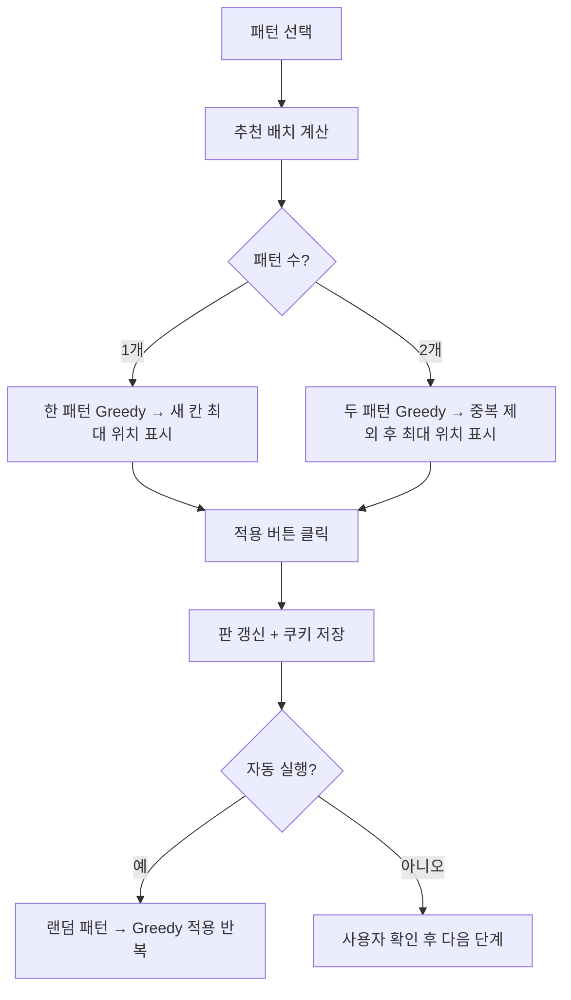

# 마녀들의 초대 효율 계산기 2.0 — 빙고 최적 적용 로직 (간소화)

## 1. 목표
- 7x7 빙고판을 **빠르고 손실 없이** 채우기  
- **손실** = 이미 채워진 칸에 또 패턴을 겹치는 것  

---

## 2. 패턴
| 패턴 | 모양 | 칸 수 |
|-------|------|------|
| × | 대각선 | 5 |
| ✚ | 십자 | 5 |
| ■ | 3x3 정사각형 | 9 |
| ㅡ | 가로 한 줄 | 7 |
| ㅣ | 세로 한 줄 | 7 |

---

## 3. 핵심 로직

### ① 후보 위치 계산
- 각 패턴을 **판 위 어디에 놓을 수 있는지** 미리 계산  
- 판을 벗어나는 위치 제외

### ② 효율 계산
- **효율** = 새로 채워지는 칸 수  
- 이미 채워진 칸은 제외

### ③ 최적 위치 선택
- **한 패턴:** 새 칸 최대인 위치 선택  
- **두 패턴:** 중복 제외 후 새 칸 최대 조합 선택  

### ④ 적용 순서
1. 패턴 선택  
2. **추천 배치 표시** → 최적 위치 표시  
3. **적용** → 판 갱신  
4. 필요 시 **되돌리기 가능**  

---

## 4. X와 ✚ 중복 최소화 이유
- X(대각선)와 ✚(십자)를 **같은 칸에 겹치지 않도록** 조정  
- 이유:
  - 둘 다 중앙 포함 → 겹치면 새로 채워지는 칸 수가 줄어듦  
  - **효율 최대화** 위해 중앙에서만 중복 발생

---

## 5. 자동 적용
- 랜덤 패턴 선택 → 최적 위치 계산 → 적용  
- 반복 → 빙고판 빠르게 채움  
- **중복 최소화 + 이미 채워진 칸 무시**

---

## 6. 로직 플로우

